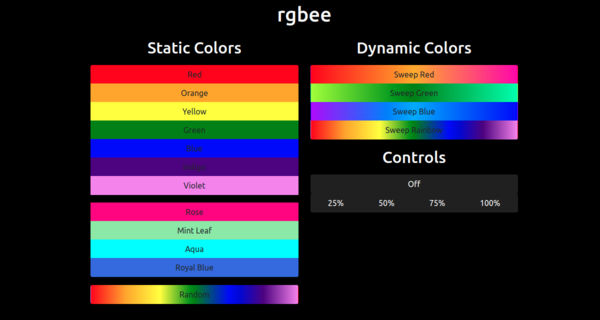
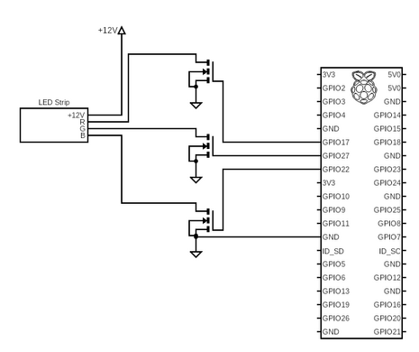
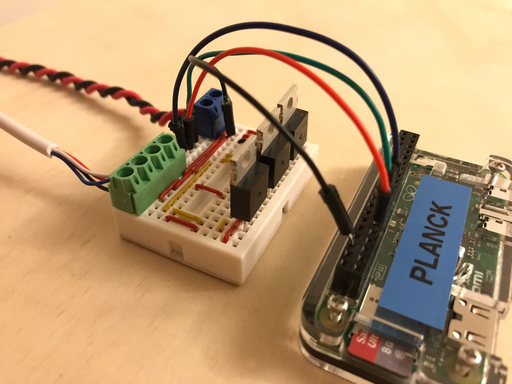

# rgbee

A minimal browser based controller for an RGB LED strip, using a Raspberry Pi.



## Overview

- Used with 4 terminal LED strips (RGB/Power)
- Requires a driver circuit from Raspberry Pi to terminals
- Runs a web-server with a front-end user interface
- API to select colors, patterns and brightness
- Uses pigpio library to control PWM pins
- Front-end is mobile and device friendly

## Driver Circuit

The LED strip draws a large current which the Raspberry Pi cannot supply, and the LED strip runs at a higher voltage than the Raspberry Pi. A MOSFET is generally used as a switch for each of the 3 RGB signals. A PWM signal is generated by the Raspberry Pi to mimic an analog voltage, and fed to the MOSFET gate. The MOSFET will switch the LED strip using an external power supply (typically 12V and 5+ Amps depending on the LED strip length). Note the Raspberry Pi and 12V supply grounds are connected to avoid floating voltages.





## Installation

Install all dependencies
```
sudo apt install git
sudo apt install python-pigpio
sudo apt install nodejs
sudo apt install aptitude
sudo aptitude install npm
npm install express
npm install child_process
```

Install rgbee to `/opt`
```
sudo git clone https://github.com/30hours/rgbee.git /opt
```

Enable systemd services to start at boot
```
cd /opt/rgbee/script
sudo cp rgbee.service /etc/systemd/system
sudo systemctl daemon-reload
sudo systemctl enable rgbee.service
sudo systemctl enable pigpiod
sudo systemctl start rgbee.service
sudo systemctl start pigpiod
```

Check the web-server is running
```
sudo systemctl status rgbee
```

The web-server will be visible on `http://<ip-address-of-raspberry-pi>:3000`

## Todo

- Provide Raspberry Pi OS image with `rgbee` pre-installed
- Add variables times for fading and dynamic patterns
